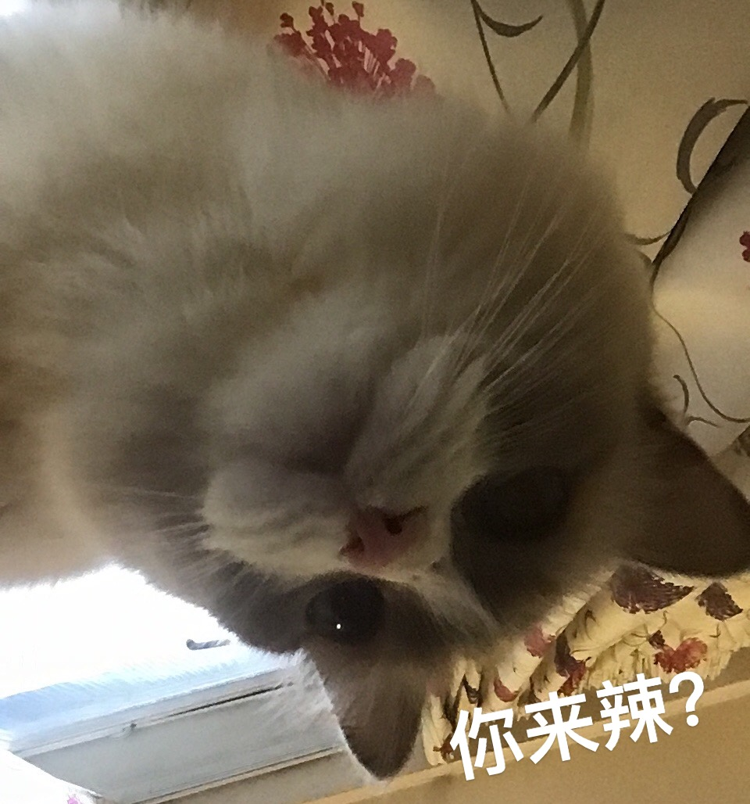

# Beloved Naomi
This repo is for sharing photos & stories, storing documents, and sharing useful information with all pet owners.  
<!-- 此repo用于分享糯米的照片和故事、存储相关的文档以及与所有宠物主人共享有用的信息。-->

If you have any problem about pet ownership, please check [here](https://www.justgreatlawyers.com/pet-paperwork).

# Basic information
姓名Name: 糯米/Naomi  
性别Gender: Male  
品种Breed: Ragdoll  
颜色Colour: Bicolour  
是否绝育Neutered: Yes  
生日Birthday: 11th March 2019  
Microchip number: 953010100372319  

# Contents
- [糯米日记/Naomi's diary](subsec/naomi_diary.md) [last updated on _01/09/2023_]  
- [糯米的文件/Naomi's documents](subsec/docs.md)  
- [伦敦兽医/London vet info](subsec/london_vet_info.md)  
- [猫用药物汇总/Summary of medicine](subsec/med_summary.md)  
- [猫咪驱虫相关知识/cat deworming](https://www.zhihu.com/question/285641623)  

